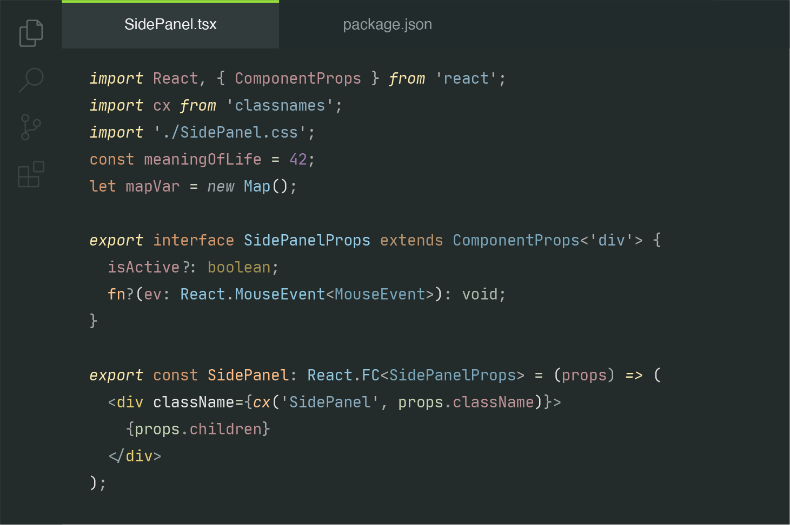

<h1 align="center">Slimy</h1>

 

A dark, slimy theme for your editor. Inspired by [smlombardi](https://marketplace.visualstudio.com/publishers/smlombardi)'s [Slime Theme](https://github.com/smlombardi/theme-slime). Example files for testing borrowed liberally from [Night Owl](https://github.com/sdras/night-owl-vscode-theme).

Available with and without indent styles applied.

## PSA
This is my first VS Code theme, so if anything looks weird feel free to file and issue or submit a PR. It's also likely to change a bit as I test and experiment in different languages, so if you're not comfortable with potential changes to your color theme I might wait until the 1.0.0 release to install.
